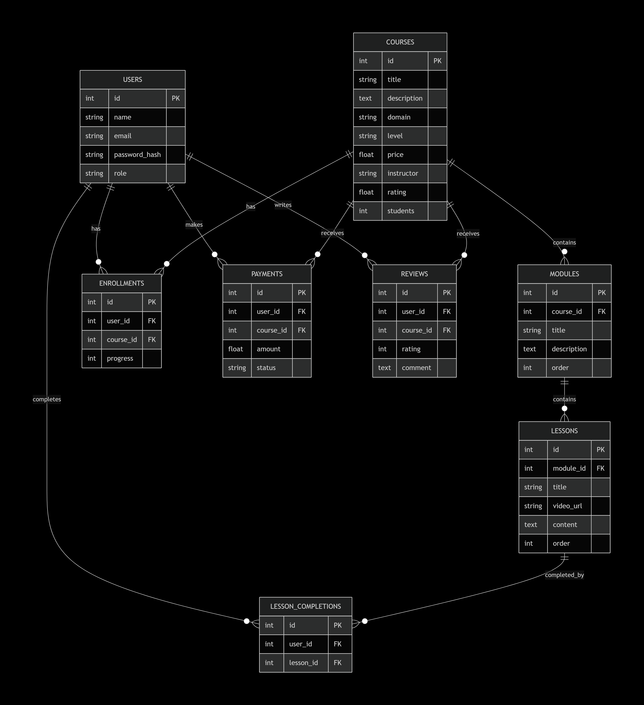

# 📚 LearnVerse - AI-Powered Online Learning Platform

> Learn Without Boundaries

## Live Demo
Currently running locally at `http://127.0.0.1:5000`

## Overview
LearnVerse is an AI-powered online learning platform that simplifies course discovery and enrollment. It provides a unified dashboard for learners to browse courses, track progress, and receive personalized recommendations. Instructors can create and manage courses, while admins maintain platform quality.

## Architecture Diagram


## ER Diagram


## Class/Module Diagram


## Tech Stack

| Layer | Technology |
|-------|------------|
| Backend | Flask 2.3.3 (Python 3.10+) |
| Database | SQLite (SQLAlchemy ORM) |
| Frontend | HTML5, CSS3, JavaScript |
| Templates | Jinja2 |
| Auth | Session-based (JWT planned for Day 41) |
| AI | Content-based filtering |
| Testing | pytest (planned for Day 41) |

## Features

### Learner Features
- Browse courses with search and filters
- View detailed course information
- Enroll in free courses instantly
- Purchase paid courses via demo payment
- Track learning progress in dashboard
- View enrolled courses with completion status
- Personalized AI course recommendations
- Write course reviews and ratings

### Instructor Features
- Create and manage courses
- Add modules and lessons
- View student enrollments
- Track revenue

### Admin Features
- Manage all courses (Add/Edit/Delete)
- View platform analytics
- User management

## Getting Started

### Prerequisites
- Python 3.10 or higher
- Git

### Installation

```bash
# 1. Clone the repository
git clone https://github.com/Preethivel/Capstone-Project.git
cd Capstone-Project

# 2. Create virtual environment
python -m venv venv
source venv/bin/activate  # On Windows: venv\Scripts\activate

# 3. Install dependencies
pip install -r requirements.txt

# 4. Copy environment variables
cp .env.example .env

# 5. Initialize database with sample courses
cd backend
python add_sample_courses.py

# 6. Run the application
python app.py