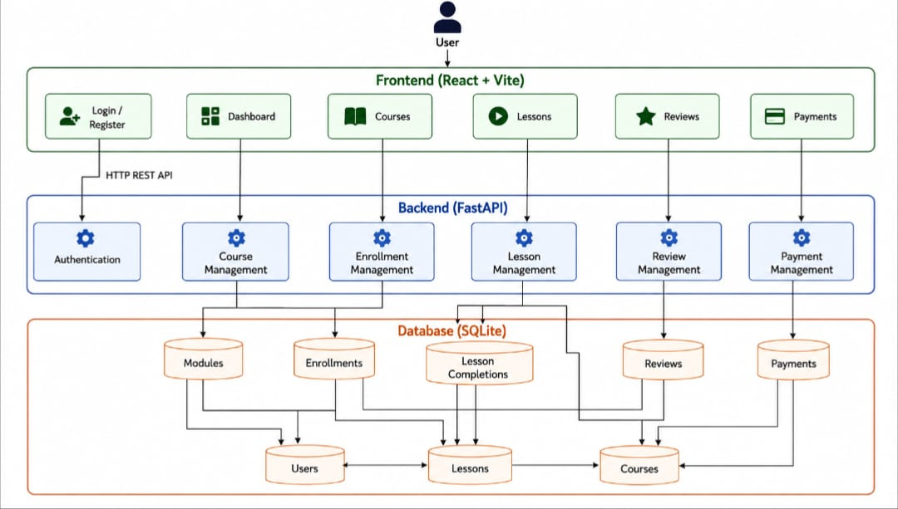

# LearnVerse — Online learning & course selling platform

## Live Demo
- **Backend API:** TODO — add Render URL after deployment
- **Frontend:** TODO — add Vercel URL after deployment
- **Demo Video:** TODO — add Loom link after recording

## Overview
LearnVerse is a role-based online learning platform for discovering courses, enrolling, following structured lessons, and tracking progress. It brings course discovery and learning tools into one place for learners, instructors, and administrators. Instructors can publish and manage courses, while administrators oversee users and course content.

## Architecture Diagram


## Tech Stack
| Layer | Technology |
|---|---|
| Frontend | React 19, Vite, React Router |
| Backend | Python, FastAPI, Uvicorn |
| Database | PostgreSQL/MySQL through SQLAlchemy; SQLite for local testing |
| ORM | SQLAlchemy |
| Authentication | JWT, bcrypt |
| API documentation | OpenAPI, Swagger UI |
| CI/CD | GitHub Actions |
| Backend hosting | Render |
| Frontend hosting | Vercel |

## Features
- **Auth:** Signup and login with JWT; learner, instructor, and administrator roles.
- **Courses:** Catalogue, search, filters, course details, external course links, and enrollment-history recommendations.
- **Enrollment:** Free enrollment and a demo checkout flow for paid courses.
- **Lessons & Progress:** Course modules and lessons, lesson completion, progress percentages, and XP.
- **Reviews:** Learner course ratings and comments.
- **Payments:** Demo payment records only; no production payment gateway.
- **AI Assistant:** Gemini-powered educational chat for course-related explanations, summaries, and practice questions.
- **Instructor:** Course, module, and lesson management with learner and course analytics.
- **Admin:** User management, course moderation, and platform statistics.

## Screenshots
_Screenshots coming soon._

## Getting Started
### Prerequisites
- Git
- Python 3.10 or newer
- Node.js 20 or newer and npm
- SQLite for local testing, or a configured MySQL/PostgreSQL service

### Clone and install
```bash
git clone https://github.com/Preethivel/Capstone-Project.git
cd Capstone-Project
python -m venv .venv
```

Activate the virtual environment:
```bash
# macOS/Linux
source .venv/bin/activate

# Windows PowerShell
.\.venv\Scripts\Activate.ps1
```

Install backend dependencies and create a local environment file from the placeholders:
```bash
pip install -r requirements.txt
cp .env.example .env
```

On Windows PowerShell, use `Copy-Item .env.example .env` instead of `cp`. Configure `DATABASE_URL` for your local database and provide a local `SECRET_KEY`; optional integrations can remain unconfigured. Start the API:
```bash
cd backend
python add_sample_courses.py
uvicorn main:app --reload --port 8000
```

In a second terminal, from the repository root:
```bash
cd react-frontend
npm install
npm run dev
```

The frontend runs at `http://localhost:5173`; the API runs at `http://localhost:8000`.

## Environment Variables
Set real values only in your local or hosting environment, never in source control.

| Variable | Description |
|---|---|
| `SECRET_KEY` | Secret used to sign authentication tokens. |
| `DATABASE_URL` | SQLAlchemy database connection URL. |
| `DB_USER` | Database username used when constructing a MySQL URL. |
| `DB_PASSWORD` | Database password used when constructing a MySQL URL. |
| `DB_HOST` | Database host used when constructing a MySQL URL. |
| `DB_NAME` | Database name used when constructing a MySQL URL. |
| `FRONTEND_URLS` | Comma-separated frontend origins allowed by CORS. |
| `ADMIN_EMAIL` | Email address assigned administrator privileges. |
| `ACCESS_TOKEN_EXPIRE_MINUTES` | JWT access-token lifetime in minutes. |
| `COOKIE_SECURE` | Whether authentication cookies require HTTPS. |
| `GEMINI_API_KEY` | Optional key for the educational AI assistant. |
| `GEMINI_MODEL` | Gemini model identifier. |
| `RESEND_API_KEY` | Optional key for transactional email. |
| `RESEND_FROM_EMAIL` | Sender address used for transactional email. |

For a Vercel frontend build, configure `VITE_API_URL` to the deployed backend API URL.

## API Documentation
Swagger UI is available at: `<backend-url>/docs`

## Running Tests
From the repository root:
```bash
pytest backend/tests -v
```

## Deployment
- **Backend:** Render (auto-deploys from `main` via GitHub Actions after the test job passes).
- **Frontend:** Vercel (auto-deploys from `main` via GitHub Actions).
- Configure hosting secrets and environment variables in the respective provider dashboards. Add the deployed URLs above after deployment.

## Folder Structure
```text
LearnVerse/
├── .github/workflows/       # GitHub Actions workflows
├── backend/
│   ├── core/                # Core helpers
│   ├── models/              # SQLAlchemy ORM models
│   ├── routes/              # FastAPI routers
│   ├── schemas/             # Pydantic request and response schemas
│   ├── services/            # Business logic and integrations
│   ├── tests/               # Backend pytest suite
│   └── main.py
├── database/                # Local database files
├── docs/diagrams/           # Architecture, ER, and class diagrams
├── react-frontend/src/      # React application
├── tests/                   # Root-level test package
├── .env.example
├── Enhancement_Proposal.md
├── LICENSE
├── Problem_Statement.md
├── requirements.txt
└── README.md
```

## Future Enhancements
- Badge awarding system
- Live class scheduling
- Certificate generation

## License
MIT. See [LICENSE](LICENSE).

## Author
Preethi P | [GitHub](https://github.com/Preethivel)
