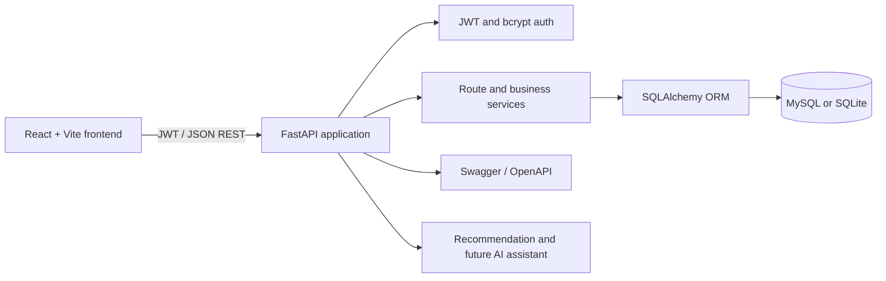

# LearnVerse Architecture

```mermaid
flowchart LR
  Browser[React + Vite frontend] -->|JWT / JSON REST| API[FastAPI application]
  API --> Auth[JWT and bcrypt auth]
  API --> Services[Route and business services]
  Services --> ORM[SQLAlchemy ORM]
  ORM --> DB[(MySQL or SQLite)]
  API --> Docs[Swagger / OpenAPI]
  API --> AI[Recommendation and future AI assistant]
```
