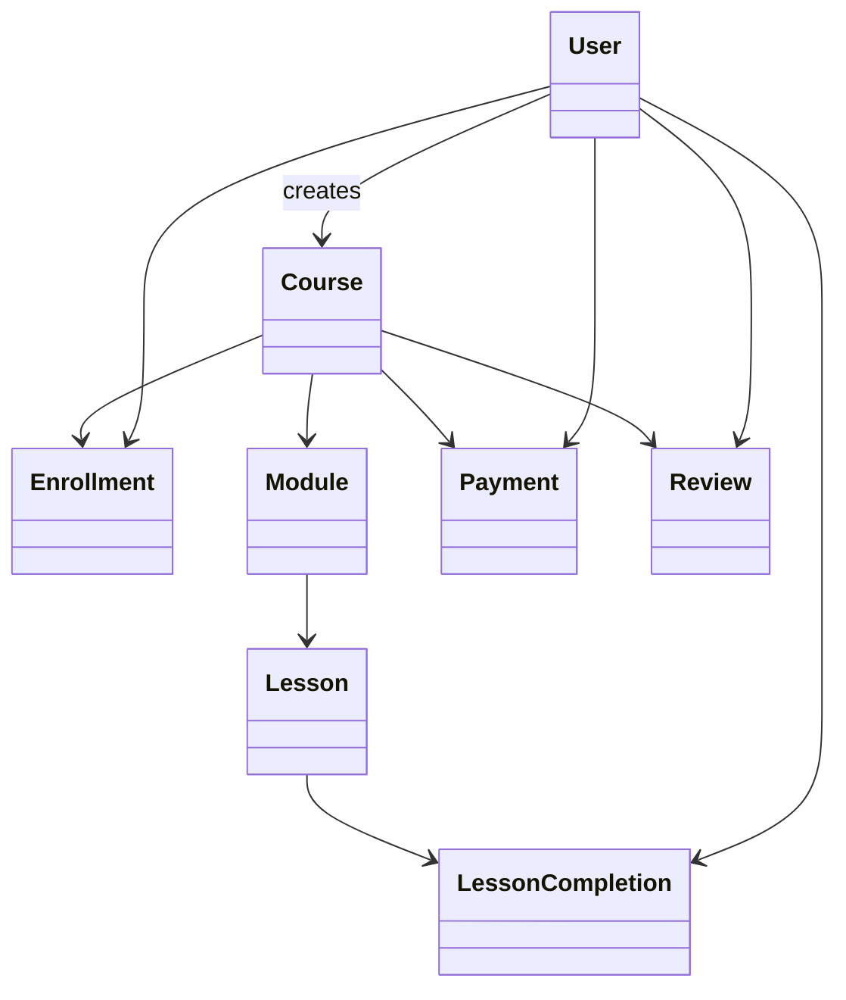

# LearnVerse Class and Module Diagram

```mermaid
classDiagram
  class User
  class Course
  class Enrollment
  class Module
  class Lesson
  class LessonCompletion
  class Payment
  class Review
  User --> Course : creates
  User --> Enrollment
  Course --> Enrollment
  Course --> Module
  Module --> Lesson
  User --> LessonCompletion
  Lesson --> LessonCompletion
  User --> Payment
  Course --> Payment
  User --> Review
  Course --> Review
```
