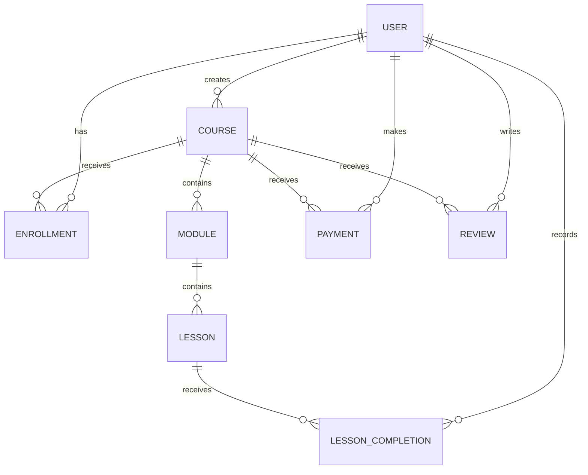

# LearnVerse ER Diagram

```mermaid
erDiagram
  USER ||--o{ COURSE : creates
  USER ||--o{ ENROLLMENT : has
  COURSE ||--o{ ENROLLMENT : receives
  COURSE ||--o{ MODULE : contains
  MODULE ||--o{ LESSON : contains
  USER ||--o{ LESSON_COMPLETION : records
  LESSON ||--o{ LESSON_COMPLETION : receives
  USER ||--o{ PAYMENT : makes
  COURSE ||--o{ PAYMENT : receives
  USER ||--o{ REVIEW : writes
  COURSE ||--o{ REVIEW : receives
```
